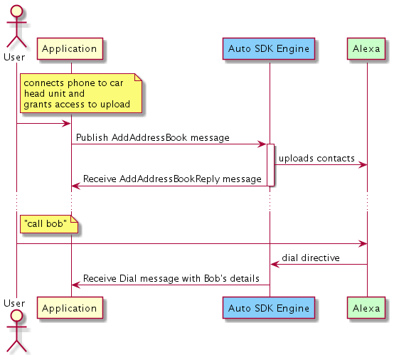
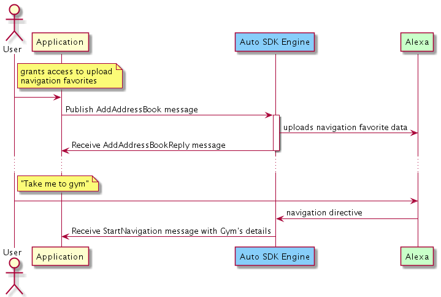
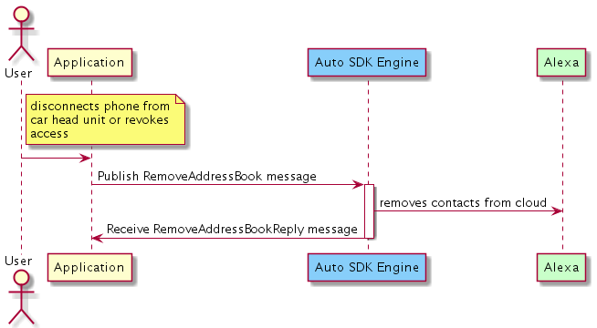
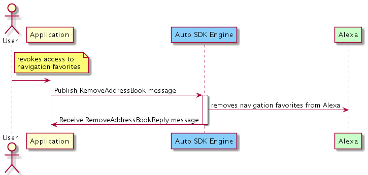

# Address Book Module

## Overview

The `Address Book` module enables your Alexa Auto SDK client application to augment the communication and navigation capabilities of Alexa with the user's contacts and favorite addresses. By using this module in your application, the user can upload their phone contacts or navigation favorites to Alexa.

This module works alongside the `Phone Control` module for calling contacts on a paired phone (e.g., "Alexa, call Mom") and the `Navigation` module for requesting directions to favorite destinations (e.g., "Alexa, take me to work"). Additionally, these features are supported offline if your application integrates with the modules of the Local Voice Control (LVC) extension.

The user contacts and favorite addresses uploaded with the `Address Book` module are only available for use on the head unit that uploaded them and not any other Alexa devices.
> **Note:** To use the Address Book functionality, your product must be placed on the allow list by Amazon. Contact your Amazon Solutions Architect (SA) or Partner Manager for details.

## Managing Address Books

Your application's `Address Book` module integration is responsible for managing the lifecycle of each address book (i.e., a set of contacts or navigation favorites). These responsibilities include the following:

* Prior to uploading any address books to the Auto SDK Engine, obtain consent from the user to allow Alexa to access their data.
* If the user revokes the permission for Alexa to access their data, immediately notify the Engine to remove the address book(s) so the Engine can delete the data from Alexa. Your implementation must ensure that the address books are removed successfully.
* If a previously uploaded address book becomes unavailable, such as when the user disconnects their phone from the head unit, notify the Engine to remove the address book. When the address book is available again, such as when the user reconnects their phone, notify the Engine to upload the address book again.
* Upload address books after starting the Engine if the user already granted permission. By default, the Engine deletes all address books from Alexa at Engine start to account for any cases in which deletion previously failed (e.g., network connection issues). This ensures the user's data is up-to-date across ignition cycles. However, note that there is an option to reduce the frequency of address book uploads described below.

### Reducing Data Usage

>**Note:** The below enhancement is not available for applications that use the LVC extension.

Since uploading an address book might consume significant data, your `Address Book` module integration has an option to reduce the data usage of repeated uploads. You can disable automatic address book removal at Engine start by providing the configuration specified in the [Configuring the Address Book Module](#configuring-the-address-book-module) section.

If your integration disables the automatic address book deletion at Engine start, an address book might not need to be uploaded to Alexa at every start. Skip reuploading address books when all of the following conditions are true:

* The last successful upload was less than 30 days ago. Note that Alexa periodically removes uploaded address books to comply with the Alexa data retention policy, so Amazon recommends reuploading the address books after 30 days.
* The user connects the same phone used for the last successful upload.
* The phone contacts and navigation favorites on the phone are the same as the address book contents of the last successful upload.

## Configuring the Address Book Module

To configure the `Address Book` module, use the *"aace.addressBook"* JSON object specified below in your Engine configuration:

```
{
    "aace.addressBook": {
        "cleanAllAddressBooksAtStart": {{BOOLEAN}}
    }
}
```

| Property | Type | Required | Description | Example
|-|-|-|-|-|
| aace.addressBook.<br>cleanAllAddressBooksAtStart | boolean | No | Whether the Engine should automatically delete all of the user's address books from Alexa at Engine start. This defaults to true if the configuration is omitted. | false

> **Note:** The  *"aace.addressBook"* configuration is optional since its only property is optional.

Like all Auto SDK Engine configurations, you can either define this JSON in a file and construct an `EngineConfiguration` from that file, or you can use the provided configuration factory function [`aace::addressBook::config::AddressBookConfiguration::createAddressBookConfig`](https://alexa.github.io/alexa-auto-sdk/docs/native/api/classes/classaace_1_1address_book_1_1config_1_1_address_book_configuration.html) to programmatically construct the `EngineConfiguration` in the proper format.

<details markdown="1"><summary>Click to expand or collapse AddressBookConfiguration C++ sample code</summary>

```cpp
#include <AACE/AddressBook/AddressBookConfiguration.h>

std::vector<std::shared_ptr<aace::core::config::EngineConfiguration>> configurations;

auto addressBookConfig = aace::addressBook::config::AddressBookConfiguration::createAddressBookConfig(false);
configurations.push_back(addressBookConfig);

// ... create other EngineConfiguration objects and add them to configurations...

m_engine->configure(configurations);

```

</details>

### Android Integration

To use the `Address Book` module Engine configuration with AACS, use *"aacs.addressBook"* instead of *"aace.addressBook"* in your AACS configuration file:

```
{
    "aacs.addressBook": {
        "cleanAllAddressBooksAtStart": {{BOOLEAN}}
    }
}
```

## Using the Address Book Module AASB Messages

### Uploading an Address Book

To upload an address book to Alexa, publish the [`AddAddressBook` message](https://alexa.github.io/alexa-auto-sdk/docs/aasb/address-book/AddressBook/index.html#addaddressbook). The Engine publishes the [`AddAddressBookReply` message](https://alexa.github.io/alexa-auto-sdk/docs/aasb/address-book/AddressBook/index.html#addaddressbookreply) to indicate upload completion or failure.

<details markdown="1"><summary>Click to expand or collapse sequence diagram: Uploading Contacts</summary>
<br></br>



</details>

<details markdown="1"><summary>Click to expand or collapse sequence diagram: Uploading Navigation Favorites</summary>
<br></br>



</details>

### Removing an Address Book

To remove an address book to Alexa, publish the [`RemoveAddressBook` message](https://alexa.github.io/alexa-auto-sdk/docs/aasb/address-book/AddressBook/index.html#removeaddressbook). The Engine publishes the [`RemoveAddressBookReply` message](https://alexa.github.io/alexa-auto-sdk/docs/aasb/address-book/AddressBook/index.html#removeaddressbookreply) to indicate removal completion or failure.

<details markdown="1"><summary>Click to expand or collapse sequence diagram: Removing Contacts</summary>
<br></br>



</details>

<details markdown="1"><summary>Click to expand or collapse sequence diagram: Removing Navigation Favorites</summary>
<br></br>



</details>

## Integrating the Address Book Module Into Your Application

### C++ MessageBroker Integration

Use the Engine's `MessageBroker` to publish *"AddressBook"* AASB messages and subscribe to their replies.

<details markdown="1"><summary>Click to expand or collapse C++ sample code</summary>

<br></br>

```cpp
#include <AACE/Core/MessageBroker.h>

#include <AASB/Message/AddressBook/AddressBook/ContactName.h>
#include <AASB/Message/AddressBook/AddressBook/NavigationName.h>
#include <AASB/Message/AddressBook/AddressBook/PhoneData.h>
#include <AASB/Message/AddressBook/AddressBook/PostalAddress.h>

#include <AASB/Message/AddressBook/AddressBook/AddAddressBookMessage.h>
#include <AASB/Message/AddressBook/AddressBook/RemoveAddressBookMessage.h>

#include <nlohmann/json.hpp>
using json = nlohmann::json;

class MyAddressBookHandler {

    // Subscribe to reply messages from the Engine
    void MyAddressBookHandler::subscribeToAASBMessages() {
        m_messageBroker->subscribe(
            [=](const std::string& message) { handleAddAddressBookReplyMessage(message); },
            AddAddressBookMessageReply::topic(),
            AddAddressBookMessageReply::action());
        m_messageBroker->subscribe(
            [=](const std::string& message) { handleRemoveAddressBookReplyMessage(message); },
            RemoveAddressBookMessageReply::topic(),
            RemoveAddressBookMessageReply::action());
    }

    // Handle the AddAddressBook reply message from the Engine
    void MyAddressBookHandler::handleAddAddressBookReplyMessage(const std::string& message) {
        AddAddressBookMessageReply msg = json::parse(message);

        std::string messageId = msg.header.messageDescription.replyToId;
        bool uploadWasSuccessful = msg.payload.success;

        // ...Handle the upload result for the message...
    }

    // Handle the RemoveAddressBook reply message from the Engine
    void MyAddressBookHandler::handleRemoveAddressBookReplyMessage(const std::string& message) {
        RemoveAddressBookMessageReply msg = json::parse(message);

        std::string messageId = msg.header.messageDescription.replyToId;
        bool uploadWasSuccessful = msg.payload.success;

        // ...Handle the removal result for the message...
    }

    // To upload contacts to Alexa, publish an AddAddressBook message to the Engine
    bool MyAddressBookHandler::uploadContacts(
        const std::string& id,
        const std::string& name) {
        AddAddressBookMessage msg;
        msg.payload.addressBookSourceId = id;
        msg.payload.name = name;
        msg.payload.type = AddressBookType::CONTACT;
        msg.payload.addressBookData = populateContacts(id);

        m_messageBroker->publish(msg.toString());

        // The Engine will send the AddAddressBookReply message
        // Return the success status from reply message payload
    }

    AddressBook MyAddressBookHandler::populateContacts(const std::string& id) {
        // Populate an AddressBook object with the contacts data from the connected phone
        AddressBook addressBook;

        // For each contact, add a ContactName to addressBook.contactNames
        // and add a PhoneData to addressBook.phoneData
        // ...

        return addressBook;
    }

    // To upload navigation favorites to Alexa, publish an AddAddressBook message to the Engine
    bool MyAddressBookHandler::uploadNavigationFavorites(
        const std::string& id,
        const std::string& name) {
        AddAddressBookMessage msg;
        msg.payload.addressBookSourceId = id;
        msg.payload.name = name;
        msg.payload.type = AddressBookType::NAVIGATION;
        msg.payload.addressBookData = populateNavigationFavorites(id);

        m_messageBroker->publish(msg.toString());

        // The Engine will send the AddAddressBookReply message
        // Return the success status from reply message payload
    }

    AddressBook MyAddressBookHandler::populateNavigationFavorites(const std::string& id) {
        // Populate an AddressBook object with the navigation favorites data from the head unit
        AddressBook addressBook;

        // For each navigation address, add a NavigationName to addressBook.navigationNames
        // and add a PostalAddress to addressBook.postalAddresses
        // ...

        return addressBook;
    }

    // To remove an address book, publish a RemoveAddressBook message to the Engine
    bool MyAddressBookHandler::removeAddressBook(const std::string& id) {
        RemoveAddressBookMessage msg;
        msg.payload.addressBookSourceId = id;
        m_messageBroker->publish(msg.toString());

        // The Engine will send the RemoveAddressBookReply message
        // Return the success status from reply message payload
    }

};

```

</details>

### Android Integration

The Alexa Auto Client Service (AACS) provides the `AACS Contacts Library` to integrate the Auto SDK `Address Book` module on Android. See the [AACS Contacts Library documentation](https://alexa.github.io/alexa-auto-sdk/docs/android/aacs/app-components/alexa-auto-contacts) for more information.
