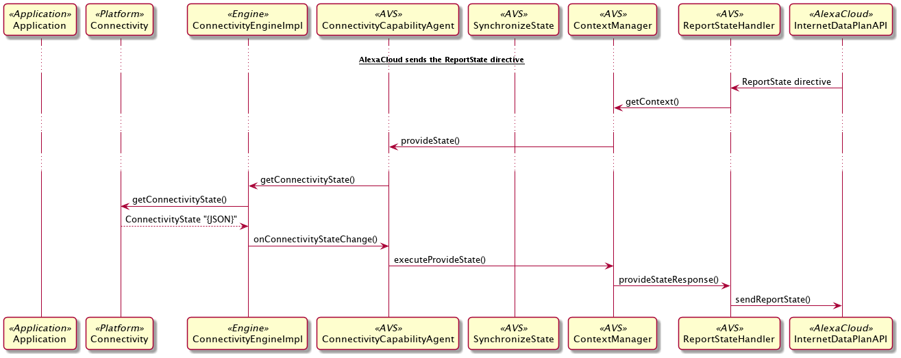
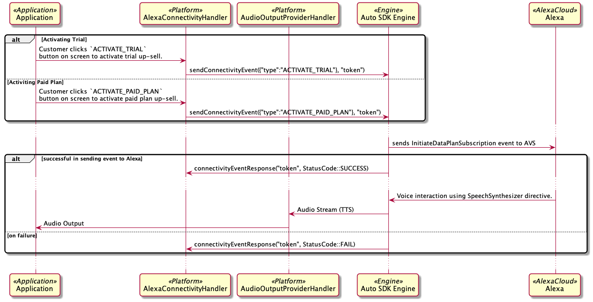

# Connectivity Module

The Connectivity module for the Alexa Auto SDK creates a lower data consumption mode for Alexa, allowing automakers to offer tiered functionality based on the status of their connectivity plans. By using this module, you can send the customer's connectivity status from the vehicle to Alexa, which determines whether the customer can enjoy a full or partial set of Alexa features. This module allows the automaker to create tiered access to Alexa for customers and offer up-sell opportunities to subscribe to a full connectivity plan.  
 
<!-- omit in toc -->
## Table of Contents
- [Overview](#overview)
- [Responsibilities of the Platform Implementation](#responsibilities-of-the-platform-implementation)
  - [Providing the Network Identifier](#providing-the-network-identifier)
  - [Providing Connectivity Status](#providing-connectivity-status)
- [Auto SDK Connectivity Sequence Diagrams](#auto-sdk-connectivity-sequence-diagrams)
  - [When Application Connects to Alexa](#when-application-connects-to-alexa)
  - [When Platform Implementation Provides Network Identifier](#when-platform-implementation-provides-network-identifier)
  - [When Alexa Requests Connectivity State Report](#when-alexa-requests-connectivity-state-report)
- [Implementing the Auto SDK with the Connectivity Module](#implementing-the-auto-sdk-with-the-connectivity-module)

## Overview

A customer who purchases an Alexa-enabled vehicle typically has to subscribe to the automaker’s connectivity plans and accept the automaker's and network provider's terms and conditions to access Alexa. Without the Connectivity module, if the customer declines the terms and conditions, or does not have a data plan (for example, due to plan expiration), the customer loses access to Alexa. The Connectivity module, however, provides an option that allows the automaker to offer a reduced set of Alexa functionality and limited bandwidth consumption for little or no cost. In this low data consumption mode, utterances sent to the cloud are filtered by feature, because the Connectivity module offers a restricted set of features. For example, when a user accesses Alexa through the Connectivity module, an utterance requesting music streaming does not start the streaming but turns on the FM radio station that was last played. Features such as weather and traffic remain accessible.  

The Connectivity module reports vehicle internet connection properties and configurations to Alexa so that the appropriate free features are available to the customer. For the Auto SDK to send internet connection information to Alexa, implement the functions provided by the AlexaConnectivity platform interface.

## Responsibilities of the Platform Implementation
The AlexaConnectivity platform interface is responsible for:

* providing the network identifier for Alexa to send to the mobile network operator (MNO)
* providing the vehicle's connectivity status information to Alexa

### Providing the Network Identifier
The network identifier is a string that uniquely identifies the vehicle in an internet connection. The identifier is required for the MNO to provide a data plan to the customer who wants to get the full Alexa experience.

When the Auto SDK Engine starts, it retrieves the network identifier from the platform implementation and sends the identifier to Alexa, which is then sent to the MNO. The identifier can be used regardless of the type of data plan. Examples of the network identifier are the Embedded SIM ID (eSIM ID) and a globally unique ID (GUID). Which ID to use depends on the implementation determined in agreement with Amazon, OEM, and MNO.

To specify the network identifier, implement the `getIdentifier()` function as shown in the following example:

```cpp
std::string AlexaConnectivityHandler::getIdentifier() {
    return "";
}
```

If you do not implement this function, the Engine uses the `vehicleIdentifier` in the Engine configuration  as the network identifier. To learn more about vehicle information in the Engine configuration, see the [Core module README](../core/README.md#vehicle-information-requirements). 

### Providing Connectivity Status
To report a connectivity status change to Alexa, call `connectivityStateChange()`. The Engine calls `getConnectivityState()` to retrieve the state as JSON in response to `connectivityStateChange()` and at Engine initialization.

Alexa parses the internet connectivity information from the vehicle and determines whether the customer is eligible for the full or partial Alexa experience. The payload in JSON produced by `getConnectivityState()` has the following schema:

```jsonc
 {
    "managedProvider": {
        "type": "{{STRING_ENUM}}",
        "id": "{{STRING}}"
    },
    "termStatus": "{{STRING_ENUM}}",
    "termsVersion": "{{STRING}}",
    "dataPlan": {
        "type": "{{STRING_ENUM}}",
        "endDate": "{{STRING}}"
    },
    "dataPlansAvailable": ["{{STRING}}", "{{STRING}}", ...]
}
```

The following table describes the objects in the JSON payload:

| Property | Type | Description | Required
|-|-|-|-|
| `dataPlan` | Object | It provides the active data plan type and end date. | Yes (only when `managedProvider.type` is `MANAGED`) 
| `dataPlan.type` | String | **Accepted values:** <ul><li>`PAID` indicates that the device has an active data plan paid for by the customer.<li>`TRIAL` indicates that the device has an active data plan which has been provided to the customer as a promotional event.<li>`AMAZON_SPONSORED` indicates that the customer has not paid for a data plan or signed up for a free trial. The customer can connect to the internet via a plan sponsored by Amazon and can access a limited number of Alexa features.</ul> A customer with either of `PAID` or `TRIAL` data plan has unrestricted access to all Alexa features. | Yes
| `dataPlan.endDate` | String | It specifies the date on which the trial data plan ends. If it is not set, there is no end date for the plan. The value is in the RFC 3339 format. | Yes (only when `dataPlan.type` is `TRIAL`)
| `termsStatus` | String | It indicates whether the customer has accepted the terms and conditions of the OEM and MNO. If it is not set, the behavior is the same as when it is set to `DECLINED`. <br>**Accepted values**:<br><ul><li>`ACCEPTED` means that the customer has agreed to receive voice messages from Alexa, which enable the customer to use voice to purchase a data plan.<li>`DECLINED` means that the customer does not accept the terms and conditions, and will not receive reminders from Alexa for a data plan upgrade.<li>`DEFERRED` means that the customer does not accept the terms and conditions, and will not receive reminders from Alexa for a data plan upgrade. However, Alexa might remind the user to respond to the terms and conditions again.</ul> | No, but recommended
| `termsVersion` | String | It indicates the version of the terms and conditions presented to the user. Do not use `termsVersion` if you do not use `termsStatus`. Maximum length is 250 characters. <br>**Note:** If you implemented Auto SDK 3.1 with the Connectivity module, a default value is automatically assigned to `termsVersion`. For Auto SDK 3.2 or later, be sure to specify `termsVersion`. Otherwise, the MNO is not notified of the correct version of the terms and conditions presented to the user. | Yes (only when `termsStatus` is provided)
| `dataPlansAvailable` | String array | It indicates the data plans that can be activated. Accepted values are `PAID`, `AMAZON_SPONSORED`, and `TRIAL`. For example, if the array is `["TRIAL", "AMAZON_SPONSORED", "PAID"]`, Alexa encourages the user to upgrade from an AMAZON_SPONSORED plan to a TRIAL plan or from a TRIAL plan to a PAID plan. | No
| `managedProvider` | Object | It provides information about the type of network connectivity that the device has. | Yes
| `managedProvider.type` | String | **Accepted Values:**<br><ul><li>`MANAGED` means the device's internet connectivity is managed by a provider. The only possible provider that manages connectivity is Amazon. The Alexa experience is affected by the current connectivity state in the following ways:<ul><li>If the customer is on a paid or trial data plan, `MANAGED` has no effect on the customer's Alexa experience. <li>If the customer does not have a paid or trial data plan, the customer, through the AlexaConnectivity platform interface, can access a limited number of Alexa features.</ul><li>`NOT_MANAGED` means the device's internet connectivity is not managed by a provider. For example, assign this value if the customer accesses the internet via a WiFi network or mobile hotspot. The customer can access all Alexa features, regardless of the current connectivity state.</ul> | Yes
| `managedProvider.id` | String | It specifies the name of the provider that manages connectivity. The only accepted value is `AMAZON`. | Yes (only when `managedProvider.type` is `MANAGED`)

### Activating Voice Up-Sell Conversation
To activate the voice up-sell conversation with Alexa, for example, to activate the trial or paid plan subscription, call `sendConnectivityEvent` with the event represented in the JSON schema:

```jsonc
  {
    "type": "{{STRING}}"
  }
```

>**Note:** Alexa requires the customer to have accepted the OEM and network provider's terms and conditions before starting the voice conversation.

The following table describes the objects in the JSON payload:

| Property | Type | Description | Required
|-|-|-|-|
| `type` | String | Represents the type of the connectivity event to Alexa. <br>**Accepted Values**:<br><ul><li>`ACTIVATE_TRIAL` for Alexa to begin the trial data plan activation (if available). Alexa, upon receiving this event, may perform some validations and eligibility checks before starting the voice conversation. <br> **Note:** If the platform implementation cannot determine the data plan type, use this event type. Alexa would first check the trial eligibility. If the customer is not eligible, Alexa begins the paid plan voice conversation. <li> `ACTIVATE_PAID_PLAN` for Alexa to begin the paid data plan activation. Alexa, upon receiving this event, may perform some validations and eligibility checks before starting the voice conversation.| Yes 

The Engine calls `connectivityEventResponse` to notify the platform implementation of the status of `sendConnectivityEvent`. The parameters in `connectivityEventResponse` are used as follows:

  * `token` is the unique identifier sent by the Engine when replying to `sendConnectivityEvent`.
  * `statusCode` is set to "SUCCESS" if the event is successfully sent to Alexa. Otherwise, it is set to "FAIL".

## Auto SDK Connectivity Sequence Diagrams
The sequence diagram below shows the major information flows from the Connectivity module to Alexa.

### When Application Connects to Alexa
The following sequence diagram illustrates the flow when a client application starts a connection with Alexa. 


### When Platform Implementation Provides Network Identifier
The following sequence diagram illustrates the flow when the platform implementation provides the network identifier to Alexa during device discovery. 


### When Alexa Requests Connectivity State Report
The following sequence diagram illustrates the flow when Alexa requests that the Connectivity module report its current connectivity state.



### When Customer Activates Up-sell Conversation
The following sequence diagram illustrates the flow when the customer starts an up-sell conversation, which results in activating either a trial subscription or a paid data plan subscription.



## Implementing the Auto SDK with the Connectivity Module
To implement the Auto SDK with Connectivity, extend the `AlexaConnectivity` class. For more information about this class, see [Connectivity Interface](./platform/include/AACE/Connectivity/AlexaConnectivity.h).

To see an example of extending `AlexaConnectivity`, go to the [C++ code example](../../samples/cpp/SampleApp/src/Connectivity/AlexaConnectivityHandler.cpp).