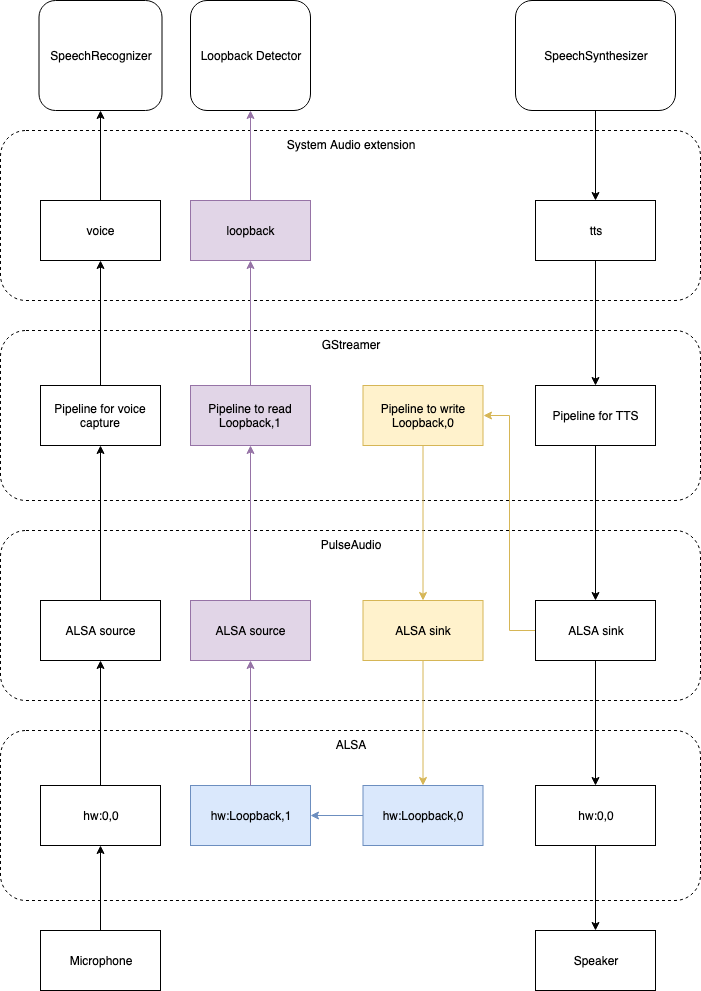

# Loopback Detector Module

**Table of Contents**

* [Overview](#overview)
* [Configuring the Loopback Detector Module](#configuring-the-loopback-detector-module)
* [Setting up the Loopback Detector Module](#setting-up-the-loopback-detector-module)

## Overview

The `Loopback Detector` module enables your Alexa Auto SDK client application to monitor wake word detection to cancel out self references.

In some environments where *acoustic echo cancellation* capabilities are limited, the microphone may pick up the wake word from speakers, which will cause false wake word detection. For example, if the user says "Alexa, what's your name?", Alexa responds with "My name is Alexa", which may cause false wake word detection and interrupt the current speech output.

The `Loopback Detector` module solves this issue by capturing speaker reference "loopback" audio and trying to detect the wake word at the same time.

## Configuring the Loopback Detector Module

The `Loopback Detector` module can be optionally configured with the following configuration structure:

```json
{
  "aace.loopbackDetector" : {
      "wakewordEngine" : "<WAKEWORD ENGINE NAME>"
  }
}
```
## Setting up the Loopback Detector Module

### Providing Audio

The `Loopback Detector` module requests audio through the `StartAudioInput` AASB message. The `StartAudioInput` message payload contains a field `audioType` set to `LOOPBACK`. The `StopAudioInput` AASB message is sent to request that audio input be stopped. The example below shows how to handle the `StartAudioInput` and `StopAudioInput` messages.

```c++
#include <AASB/Message/Audio/AudioInput/StartAudioInputMessage.h>
#include <AASB/Message/Audio/AudioInput/StopAudioInputMessage.h>

#include <nlohmann/json.hpp>
using json = nlohmann::json;

// Loopback stream id
std::string m_streamId;

// subscribe to the StartAudioInput message
messageBroker->subscribe([=](const std::string& msg) {
        // parse the json message
        StartAudioInputMessage _msg = json::parse(msg);
        m_streamId = _msg.payload.streamId;
        auto audioType = _msg.payload.audioType;
        if (audioType == "LOOPBACK") {
            // open the stream for writing
            auto stream = messageBroker->openStream(
                m_streamId,
                MessageStream::Mode::WRITE);
            if (stream != nullptr) 
                startAudioInput(m_streamId, stream)
        }
    }),
    StartAudioInputMessage::topic(),
    StartAudioInputMessage::action());

// subscribe to the StopAudioInput message
messageBroker->subscribe([=](const std::string& msg) {
        // parse the json message
        StopAudioInputMessage _msg = json::parse(msg);
        auto streamId = _msg.payload.streamId;
        if (streamId == m_streamId) {
            stopAudioInput(streamId);
            m_streamId = "";
        } 
    }),
    StopAudioInputMessage::topic(),
    StopAudioInputMessage::action());    


void startAudioInput(const std::string& streamId, std::shared_ptr<MessageStream> stream) {
    // On another thread, write data to the stream until
    // you receive a StopAudioInput message with the same streamId
    // ...
    // Return quickly to avoid blocking the MessageBroker's outgoing thread!
} 

void stopAudioInput(const std::string& streamId) {
    // Stop writing audio data to the stream
    // ...
    // Return quickly to avoid blocking the MessageBroker's outgoing thread!
}
```

This audio source should be the final mix of audio output (i.e. speaker reference/monitor).

+>**Note:** If you are using the System Audio module, see the [System Audio module README](../system-audio/README.md) for details about how to specify `LOOPBACK` audio input provider.

### Building with the Loopback Detector Module

To build the Alexa Auto SDK with the Loopback Detector module, simply include the module when running the Auto SDK builder:

```
$ builder/build.py -m loopback-detector
```
### Example Setup in Ubuntu Linux

Here is an example of how to provide loopback audio into the Alexa Auto SDK.

You will need the following software running on a Linux system:

* PulseAudio
* GStreamer
* Advanced Linux Sound Architecture (ALSA) `snd_aloop` module

If you are using the [System Audio module](../system-audio/README.md), the Auto SDK (and all other applications on Linux) will use PulseAudio to output audio by default. PulseAudio mixes all audio then plays it through a hardware device. We need to capture this "final mix result" into the GStreamer pipeline and pass it through directly into the ALSA loopback device so the Auto SDK can capture this audio. To do this, follow these steps:

1. Make sure the `snd_aloop` module is loaded into kernel by running `sudo modprobe snd_aloop`.
1. Use this command to launch the GStreamer pipeline:
    ```
    gst-launch-1.0 -v autoaudiosrc ! audio/x-raw,format=S16LE,channels=1,rate=16000,layout=interleaved ! audioconvert ! audioresample ! alsasink device=hw:Loopback,0,0
    ```
    
    >**Note:** You need to keep this process throughout the testing.
1. Open the PulseAudio control panel (`pavucontrol`), and go to the **Recording** panel.
1. You will see that the **gst-launch-1.0** process is capturing the audio. Change the audio source to **Monitor of Built-in Audio Analog Stereo**.
1. Set the **SampleApp Record Stream** to **microphone device**.

At this point, all speaker outputs (through PulseAudio) will be eventually routed to the ALSA loopback device.

If you are using the System Audio module, ensure the `LOOPBACK` type and `loopback` device are configured correctly.

```
"aace.systemAudio": {
  "AudioInputProvider": {
    "devices": {
      "default": {
        "module": "GStreamer"
      },
      "loopback": {
        "module": "GStreamer",
        "card": "hw:Loopback,1,0",
        "shared": true
      }
    },
    "types": {
      "LOOPBACK": "loopback"
    }
  },
  "AudioOutputProvider": {
    "devices": {
      "default": {
        "module": "GStreamer"
      }
    }
  }
}
```

After this, the Auto SDK can capture audio loopback from the `hw:Loopback,1,0` device.

The following diagram illustrates how the audio output data is routed to the Loopback Detector on Linux:

